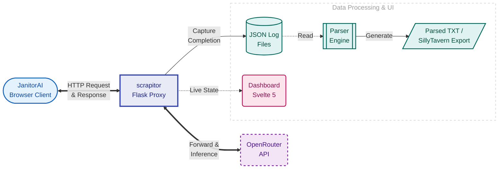

<p align="center">
  
</p>

<h1 align="center">scrapitor</h1>

<p align="center">
  <strong>Intercept. Parse. Export.</strong>
</p>

<p align="center">
  
  
  
  
</p>

---

A local proxy that intercepts JanitorAI traffic, captures request payloads as JSON logs, and provides a rule-driven parser to extract clean character sheets. Exports to SillyTavern-compatible JSON format.

## Table of Contents

- [Quick Start](#quick-start)
  - [Windows](#quick-start-windows)
  - [Linux/macOS](#quick-start-linuxmacos)
  - [Termux/Android](#quick-start-termuxandroid)
- [Architecture](#architecture)
- [Installation](#installation)
  - [Windows](#windows-recommended)
  - [macOS / Linux](#macos--linux)
  - [Termux (Android)](#termux-android)
- [Configuring JanitorAI](#configuring-janitorai)
- [Web Dashboard](#web-dashboard)
- [Parser System](#parser-system)
- [CLI Usage](#cli-usage)
- [API Reference](#api-reference)
- [Configuration](#configuration)
- [Docker](#docker)
- [Troubleshooting](#troubleshooting)
- [Development](#development)
- [Notes](#notes)

---

## Quick Start

### Quick Start (Windows)

1. Download: https://github.com/daksh-7/scrapitor → Code → Download ZIP → Unzip
2. Double-click `run.bat`
3. Copy the Cloudflare Proxy URL from the terminal
4. In JanitorAI: Enable "Using proxy" → paste the URL → add your OpenRouter API key
5. Send a message — your request appears in the dashboard Activity tab

**Requirements:** Python 3.10+ and PowerShell 7. The launcher auto-installs everything else.

### Quick Start (Linux/macOS)

1. Clone and run:

```bash
git clone https://github.com/daksh-7/scrapitor && cd scrapitor && ./run.sh
```

2. Copy the Cloudflare Proxy URL from the terminal
3. In JanitorAI: Enable "Using proxy" → paste the URL → add your OpenRouter API key

**Requirements:** Python 3.10+, curl, and bash. The launcher auto-installs cloudflared and Python dependencies.

### Quick Start (Termux/Android)

1. Install [Termux from F-Droid](https://f-droid.org/en/packages/com.termux/) (Play Store version is outdated)

2. Install dependencies:

```bash
pkg update && pkg upgrade -y && pkg install python git curl cloudflared -y
```

3. Clone and run:

```bash
git clone https://github.com/daksh-7/scrapitor && cd scrapitor && ./run.sh
```

4. In another Termux session, run `termux-wake-lock` to prevent Android from killing the process
5. Copy the Cloudflare Proxy URL and use it in JanitorAI

**Requirements:** Termux with python, curl, git, and cloudflared packages. ARM64 device required.

---

## Architecture


```mermaid
graph LR
    %% --- NODES & DATA ---
    J([JanitorAI<br/>Browser Client])
    S[scrapitor<br/>Flask Proxy]
    OR(OpenRouter<br/>API)

    subgraph Data_Processing [Data Processing & UI]
        direction TB
        L[(JSON Log<br/>Files)]
        P[[Parser<br/>Engine]]
        D(Dashboard<br/>Svelte 5)
        E[/Parsed TXT /<br/>SillyTavern Export/]
    end

    %% --- CONNECTIONS ---
    %% Bi-directional traffic flow
    J <==>|HTTP Request<br/>& Response| S
    S <==>|Forward &<br/>Inference| OR
    
    %% Internal Data flow
    S -.->|Live State| D
    S -- Capture<br/>Completion --> L
    L -.->|Read| P
    P -->|Generate| E

    %% --- STYLING ---
    classDef base fill:#fff,stroke:#333,stroke-width:1px,color:#333;
    classDef client fill:#e3f2fd,stroke:#1565c0,stroke-width:2px,color:#0d47a1;
    classDef proxy fill:#e8eaf6,stroke:#3949ab,stroke-width:3px,color:#1a237e;
    classDef external fill:#f3e5f5,stroke:#7b1fa2,stroke-width:2px,stroke-dasharray: 5 5,color:#4a148c;
    classDef storage fill:#e0f2f1,stroke:#00695c,stroke-width:2px,color:#004d40;
    classDef ui fill:#fce4ec,stroke:#c2185b,stroke-width:2px,color:#880e4f;
    
    %% Apply Styles
    class J client;
    class S proxy;
    class OR external;
    class L,P,E storage;
    class D ui;

    %% Style Subgraph
    style Data_Processing fill:#ffffff,stroke:#e0e0e0,stroke-width:2px,stroke-dasharray: 5 5,color:#9e9e9e
```

**Data Flow:**

1. JanitorAI sends chat requests to the scrapitor proxy (via Cloudflare tunnel)
2. scrapitor logs the full request payload as JSON, then forwards to OpenRouter
3. The parser extracts character data using tag-aware rules
4. Parsed content is saved as versioned `.txt` files or exported to SillyTavern JSON

---

## Installation

### Windows (Recommended)

**Prerequisites:**
- Python 3.10+ ([Download](https://www.python.org/downloads/) — check "Add python.exe to PATH")
- PowerShell 7: `winget install Microsoft.PowerShell`

**Option A:** Download ZIP from GitHub → Code → Download ZIP → Unzip

**Option B:** Clone with Git:

```powershell
git clone https://github.com/daksh-7/scrapitor && cd scrapitor
```

**Then:** Double-click `run.bat`

The launcher will:
- Create a virtual environment and install dependencies
- Build the Svelte frontend (if Node.js is available and sources changed)
- Start Flask on port 5000
- Establish a Cloudflare tunnel and display the public URL
- Show live status (press Q to quit)

```
███████╗ ██████╗██████╗  █████╗ ██████╗ ██╗████████╗ ██████╗ ██████╗
██╔════╝██╔════╝██╔══██╗██╔══██╗██╔══██╗██║╚══██╔══╝██╔═══██╗██╔══██╗
███████╗██║     ██████╔╝███████║██████╔╝██║   ██║   ██║   ██║██████╔╝
╚════██║██║     ██╔══██╗██╔══██║██╔═══╝ ██║   ██║   ██║   ██║██╔══██╗
███████║╚██████╗██║  ██║██║  ██║██║     ██║   ██║   ╚██████╔╝██║  ██║
╚══════╝ ╚═════╝╚═╝  ╚═╝╚═╝  ╚═╝╚═╝     ╚═╝   ╚═╝    ╚═════╝ ╚═╝  ╚═╝

  [✓] Python 3.14.0 found
  [✓] Dependencies up to date
  [✓] Cloudflared ready
  [✓] Flask healthy on :5000
  [✓] Tunnel ready

  ┌────────────────────────────────────────────────────────────────┐
  │  Dashboard:  http://localhost:5000                             │
  │  LAN:        http://192.168.0.101:5000                         │
  │  Proxy URL:  https://example.trycloudflare.com/openrouter-cc   │
  └────────────────────────────────────────────────────────────────┘
```

### macOS / Linux

**Prerequisites:**
- Python 3.10+ (most systems have this pre-installed)
- Bash 3.0+ (macOS ships with 3.2, Linux typically has 4.0+)
- curl (for cloudflared download)

**Supported Architectures:**
| Platform | Architecture | Notes |
|----------|--------------|-------|
| macOS | Apple Silicon (M1/M2/M3/M4) | arm64 binary auto-downloaded |
| macOS | Intel | amd64 binary auto-downloaded |
| Linux | x86_64/amd64 | Standard servers and desktops |
| Linux | aarch64/arm64 | ARM servers, Raspberry Pi 4+ (64-bit) |
| Linux | armv7l/armhf | Raspberry Pi 3 and older (32-bit) |

**Option A:** Download ZIP from GitHub → Code → Download ZIP → Unzip

**Option B:** Clone with Git:

```bash
git clone https://github.com/daksh-7/scrapitor && cd scrapitor && ./run.sh
```

The launcher will:
- Create a virtual environment at `app/.venv` and install dependencies
- Auto-download cloudflared from GitHub releases (if not found in PATH)
- Build the Svelte frontend (if Node.js is available and sources changed)
- Start Flask on port 5000
- Establish a Cloudflare tunnel and display the public URL
- Show live status with uptime (press Q to quit gracefully)

**macOS Notes:**
- If you prefer Homebrew: `brew install cloudflared` (then the launcher uses the system binary)
- On Apple Silicon, Rosetta is not required — native arm64 binary is used

**Manual Setup (alternative):**

```bash
python3 -m venv app/.venv && source app/.venv/bin/activate && pip install -r app/requirements.txt && python -m app.server
```

In another terminal (optional):

```bash
cloudflared tunnel --no-autoupdate --url http://127.0.0.1:5000
```

### Termux (Android)

Run scrapitor directly on your Android device using Termux.

**Prerequisites:**
- Install [Termux from F-Droid](https://f-droid.org/en/packages/com.termux/) (the Play Store version is outdated and will not work)
- ARM64 device required (most Android phones from 2017+ are ARM64)
- Grant storage permissions: `termux-setup-storage`

**Device Compatibility:**
| Architecture | Supported | Notes |
|--------------|-----------|-------|
| ARM64 (aarch64) | Yes | Most modern Android phones and tablets |
| ARM32 (armv7l) | No | Older devices; cloudflared binary not available |
| x86/x86_64 | Untested | Some Android emulators and Chromebooks |

**Install:**

```bash
pkg update && pkg upgrade -y && pkg install python git curl cloudflared -y
git clone https://github.com/daksh-7/scrapitor && cd scrapitor && ./run.sh
```

The launcher will:
- Create a virtual environment at `app/.venv` and install dependencies
- Detect Termux environment and show helpful tips
- Start Flask on port 5000
- Establish a Cloudflare tunnel and display the public URL
- Show live status with uptime (press Q to quit gracefully)

**Preventing Android from Killing Termux:**

Android aggressively kills background apps to save battery. To keep scrapitor running:

```bash
termux-wake-lock          # Option 1 (recommended): Run in separate session
pkg install termux-services  # Option 2: Install termux-services
# Option 3: Disable battery optimization for Termux in Android settings
```

**Optional packages:**

```bash
pkg install nodejs           # For frontend building (~200MB)
pkg install net-tools iproute2  # For better LAN IP detection
```

**Tips for Termux:**
- Access the dashboard from your device's browser at `http://localhost:5000`
- Use a split-screen or floating window to keep Termux visible
- The LAN URL (e.g., `http://192.168.x.x:5000`) works for other devices on your WiFi
- If you see "Termux killed in background," the wake-lock wasn't active

---

## Configuring JanitorAI

1. Open a character chat in JanitorAI
2. Click **"using proxy"** and create a new proxy configuration
3. Set **Model name** to: `nvidia/nemotron-3-super-120b-a12b:free`
4. Set **Proxy URL** to your Cloudflare endpoint (ends with `/openrouter-cc`)
5. Set **API Key** to your [OpenRouter API key](https://openrouter.ai/keys)
6. Click **Save changes**, then **Save Settings**, and refresh the page
7. Send a test message to verify the connection

---

## Web Dashboard

Access the dashboard at:
- **Localhost:** `http://localhost:5000` — from the same machine
- **LAN:** `http://<your-ip>:5000` — from any device on your network (phones, tablets, other computers)
- **Cloudflare:** Your tunnel URL — from anywhere on the internet

### Overview
- **Metrics:** Request count, log files, parsed outputs, server port
- **Endpoints:** Copy model name, Cloudflare URL, and local URL
- **Quick Start:** Step-by-step JanitorAI setup guide

### Parser
- **Modes:**
  - **Default:** Outputs all character content, Scenario, and First Message (no filtering)
  - **Custom:** Fine-grained control with Include/Exclude tag sets
- **Tag Chips:** Click to toggle between Include and Exclude states
- **Detect Tags:** Scan logs to discover available tags
- **Write:** Generate versioned `.txt` outputs for latest or selected logs
- **Export:** Create SillyTavern-compatible JSON (chara_card_v3 spec)

### Activity
- Browse captured request logs (newest first)
- Open raw JSON or rename log files inline
- View parsed TXT versions with a version picker
- Multi-select logs/parsed files for batch export to SillyTavern

---

## Parser System

The parser extracts structured character data from JanitorAI request payloads.

### Extraction Rules

1. **Newlines:** Replace literal `\n` sequences with actual newlines
2. **System Message:** Extract from the first message with `role: "system"`
3. **Character Name:** First opening tag that isn't `system`, `scenario`, `example_dialogs`, `persona`, or `userpersona`
4. **Character Content:** Inner text of the character tag block
5. **Scenario:** `<Scenario>...</Scenario>` block (if outside the character block)
6. **First Message:** First `assistant` message content
7. **Untagged Content:** Any text outside recognized tag blocks

### Filtering Modes

| Mode | Behavior |
|------|----------|
| **Default** | Output everything (no filtering) |
| **Custom + Include** | Only output explicitly included tags/sections |
| **Custom + Exclude** | Output everything except excluded tags |

**Special Include Tags:**
- Character name (e.g., `miku`) — include the character block
- `scenario` — include the Scenario section
- `first_message` — include the First Message
- `untagged content` — include text outside tag blocks

### Version Control

Each write creates a new versioned file: `<Character Name>.v1.txt`, `.v2.txt`, etc.
Versions are stored in `app/var/logs/parsed/<json_stem>/`.

---

## CLI Usage

Default parse (no filtering):

```bash
python app/parser/parser.py path/to/log.json
```

Omit tags (blacklist):

```bash
python app/parser/parser.py --preset custom --omit-tags scenario,persona log.json
```

Include only selected tags (whitelist):

```bash
python app/parser/parser.py --preset custom --include-tags miku,scenario,first_message log.json
```

Strip tag markers but keep content:

```bash
python app/parser/parser.py --preset custom --strip-tags scenario log.json
```

Control output location and versioning:

```bash
python app/parser/parser.py --output-dir out --suffix v2 log.json
```

---

## API Reference

### Proxy Endpoints

| Method | Path | Description |
|--------|------|-------------|
| GET | `/openrouter-cc` | Proxy status and version info |
| POST | `/openrouter-cc` | Forward chat completion to OpenRouter (supports streaming) |
| POST | `/chat/completions` | Alias for `/openrouter-cc` |
| GET | `/models` | Minimal model list for compatibility |

### Log Endpoints

| Method | Path | Description |
|--------|------|-------------|
| GET | `/logs` | List recent logs with metadata |
| GET | `/logs/<name>` | Get raw JSON log content |
| POST | `/logs/<name>/rename` | Rename a log file |
| POST | `/logs/delete` | Delete log files (and their parsed directories) |
| GET | `/logs/<name>/parsed` | List parsed TXT versions |
| GET | `/logs/<name>/parsed/<file>` | Get parsed TXT content |
| POST | `/logs/<name>/parsed/rename` | Rename a parsed file |
| POST | `/logs/<name>/parsed/delete` | Delete parsed files |

### Parser Endpoints

| Method | Path | Description |
|--------|------|-------------|
| GET/POST | `/parser-settings` | Get or update parser mode and tag lists |
| POST | `/parser-rewrite` | Rewrite parsed outputs for logs |
| GET | `/parser-tags` | Detect tags from log(s) |
| POST | `/export-sillytavern` | Export to SillyTavern JSON |

### System Endpoints

| Method | Path | Description |
|--------|------|-------------|
| GET | `/tunnel` | Get Cloudflare tunnel URL |
| GET | `/health` | Health check with uptime |
| GET/POST | `/param` | View/update generation defaults |

---

## Configuration

Configuration can be set via:
1. **Environment variables** (highest priority)
2. **`.env` file** at the repo root

### Example `.env` file

```bash
PROXY_PORT=8080
OPENROUTER_API_KEY=sk-or-v1-xxxxx
LOG_LEVEL=DEBUG
```

### Available Variables

| Variable | Default | Description |
|----------|---------|-------------|
| `PROXY_PORT` | `5000` | Flask server port |
| `OPENROUTER_URL` | `https://openrouter.ai/api/v1/chat/completions` | Upstream API |
| `OPENROUTER_API_KEY` | *(empty)* | Server-side API key (optional) |
| `ALLOW_SERVER_API_KEY` | `false` | Allow using server-side key |
| `ALLOWED_ORIGINS` | `*` | CORS origins (comma-separated) |
| `LOG_DIR` | `var/logs` | Log storage directory |
| `MAX_LOG_FILES` | `1000` | Max logs before pruning oldest |
| `LOG_LEVEL` | `INFO` | Python logging level |
| `CONNECT_TIMEOUT` | `5.0` | Upstream connect timeout (seconds) |
| `READ_TIMEOUT` | `300.0` | Upstream read timeout (seconds) |
| `CLOUDFLARED_FLAGS` | *(empty)* | Extra cloudflared arguments |

---

## Docker

Cross-platform containerized deployment using Docker Compose. Ideal for servers, NAS devices, and consistent deployments.

**Prerequisites:**
- Docker Engine 20.10+ or Docker Desktop
- Docker Compose v2 (`docker compose` command)

**Architecture Support:**
| Architecture | Proxy Container | Tunnel Container |
|--------------|-----------------|------------------|
| amd64 (x86_64) | Yes | Yes |
| arm64 (aarch64) | Yes | Yes |
| arm/v7 (armhf) | Yes | Yes |

### Quick Start

```bash
docker compose up --build       # Build and start (foreground)
docker compose up -d --build    # Build and start (detached)
docker compose logs -f          # View live logs
docker compose down             # Stop all services
docker compose down -v          # Stop and remove volumes (clean slate)
```

### Services

The `docker-compose.yml` defines two services:

| Service | Description | Port |
|---------|-------------|------|
| `proxy` | Flask server with frontend | 5000 (configurable) |
| `tunnel` | Cloudflared quick tunnel | N/A (outbound only) |

The `tunnel` service waits for `proxy` to be healthy before starting, then writes the detected Cloudflare URL to `app/var/state/tunnel_url.txt` for the dashboard.

### Configuration with .env

Create a `.env` file in the repository root to configure Docker:

```bash
PROXY_PORT=5000
OPENROUTER_API_KEY=sk-or-v1-xxxxx
LOG_LEVEL=INFO
MAX_LOG_FILES=1000
CLOUDFLARED_FLAGS=--edge-ip-version 4 --loglevel info
```

All environment variables from the [Configuration](#configuration) section are supported.

### Common Commands

```bash
docker compose up --build proxy              # Start proxy only (no tunnel)
docker compose logs -f proxy                 # View proxy logs only
docker compose logs -f tunnel                # View tunnel logs only
docker compose up --build --force-recreate   # Rebuild after code changes
docker compose ps                            # Check service status
docker compose exec proxy python -c "..."    # Execute command in container
docker compose stats                         # View resource usage
```

### Persistent Data

Logs and state are persisted via volume mount:

```
./app/var → /workspace/app/var (inside containers)
```

This includes:
- `var/logs/` — captured JSON request logs
- `var/logs/parsed/` — parsed TXT outputs
- `var/state/tunnel_url.txt` — current tunnel URL

### Health Checks

The proxy container includes a built-in health check that polls `/health` every 5 seconds. The tunnel container only starts after the proxy is confirmed healthy:

```yaml
depends_on:
  proxy:
    condition: service_healthy
```

---

## Troubleshooting

### General Issues

| Issue | Solution |
|-------|----------|
| **No Cloudflare URL** | Check internet; verify firewall allows cloudflared outbound |
| **Port already in use** | Set `PROXY_PORT` to another port in `.env` |
| **502 from OpenRouter** | Ensure `Authorization` header is in the request |
| **NGINX error from trycloudflare URL** | Enable Secure DNS (1.1.1.1) in your browser or OS |
| **Frontend not loading** | Run `cd frontend && npm install && npm run build` |
| **Missing parser output fields** | Use "Detect Tags" and adjust Include/Exclude settings |

### Windows Issues

| Issue | Solution |
|-------|----------|
| **"PowerShell 7 required"** | Run `winget install Microsoft.PowerShell` |
| **Script execution disabled** | Run `Set-ExecutionPolicy -Scope CurrentUser RemoteSigned` |

### Linux/macOS Issues

| Issue | Solution |
|-------|----------|
| **"Permission denied" on run.sh** | Run `chmod +x run.sh` first |
| **"Python not found"** | Install Python 3.10+: `sudo apt install python3` or `brew install python3` |
| **"Venv Creation Failed"** | Install venv module: `sudo apt install python3.12-venv` (use your Python version) |
| **"curl not found"** | Install curl: `sudo apt install curl` or `brew install curl` |
| **"Bash 3.0+ required"** | Upgrade bash: `brew install bash` or `sudo apt install bash` |
| **Cloudflared download fails** | Install manually: `brew install cloudflared` or download from [GitHub releases](https://github.com/cloudflare/cloudflared/releases) |
| **macOS Gatekeeper blocks cloudflared** | Run `xattr -d com.apple.quarantine app/scripts/cloudflared` |

### Termux/Android Issues

| Issue | Solution |
|-------|----------|
| **"Python not found"** | Run `pkg install python` |
| **"curl not found"** | Run `pkg install curl` |
| **Termux killed in background** | Run `termux-wake-lock` in another session, or disable battery optimization |
| **Cloudflared "unexpected e_type: 2"** | Install via Termux: `pkg install cloudflared` |
| **Cloudflared fails / "check internet"** | Try: `export CLOUDFLARED_FLAGS="--protocol http2"` then re-run |
| **Cloudflared fails on Android** | Ensure you have an ARM64 device; 32-bit ARM is not supported |
| **No LAN IP detected** | Run `pkg install net-tools` or `pkg install iproute2` |
| **Storage permission denied** | Run `termux-setup-storage` and grant permission |

### Docker Issues

| Issue | Solution |
|-------|----------|
| **"docker compose" not found** | Install Docker Compose v2 or use `docker-compose` (v1 syntax) |
| **Tunnel fails to start** | Check `docker compose logs tunnel`; proxy must be healthy first |
| **Port conflict** | Change `PROXY_PORT` in `.env` or stop conflicting service |
| **Permission denied on volumes** | Check ownership of `./app/var` directory |
| **Container exits immediately** | Run `docker compose logs proxy` to see error output |
| **No tunnel URL in dashboard** | Wait 30-60 seconds; check `docker compose logs -f tunnel` |
| **Build fails on ARM** | Ensure BuildKit is enabled: `DOCKER_BUILDKIT=1 docker compose build` |

---

## Development

### Backend

Create virtual environment:

```bash
python -m venv app/.venv
```

Activate and install (Windows):

```powershell
app\.venv\Scripts\pip install -r app/requirements.txt && app\.venv\Scripts\python -m app.server
```

Activate and install (Linux/macOS):

```bash
source app/.venv/bin/activate && pip install -r app/requirements.txt && python -m app.server
```

### Frontend

```bash
cd frontend && npm install
npm run dev     # Dev server with hot reload (port 5173)
npm run build   # Production build
npm run check   # Type check
```

### Project Structure

```
scrapitor/
├── app/
│   ├── parser/              # Tag-aware parser engine
│   │   └── parser.py
│   ├── scripts/             # Launcher scripts + modules
│   │   ├── run_proxy.ps1    # Windows (PowerShell) orchestrator
│   │   ├── run_proxy.sh     # Linux/macOS/Termux (Bash) orchestrator
│   │   └── lib/             # Shared modules
│   │       ├── *.psm1       # PowerShell modules (Config, Process, Python, Tunnel, UI)
│   │       └── *.sh         # Bash modules (config, process, python, tunnel, ui)
│   ├── static/
│   │   ├── assets/          # Logo SVGs, manifest
│   │   └── dist/            # Compiled Svelte SPA (generated)
│   ├── var/                 # Runtime data (generated)
│   │   ├── logs/            # Captured JSON request logs
│   │   └── state/           # PID files, tunnel URL
│   ├── requirements.txt     # Python dependencies
│   └── server.py            # Flask application
├── frontend/
│   ├── src/
│   │   ├── lib/
│   │   │   ├── api/         # Typed API client
│   │   │   ├── components/  # Svelte UI components
│   │   │   └── stores/      # Svelte 5 runes state
│   │   ├── routes/          # Overview, Parser, Activity pages
│   │   ├── App.svelte       # Root component
│   │   └── main.ts          # Entry point
│   ├── index.html
│   ├── package.json
│   └── vite.config.ts
├── docker/
│   ├── Dockerfile           # Proxy container (Python + frontend)
│   └── tunnel/
│       ├── Dockerfile       # Tunnel container (Alpine + cloudflared)
│       └── entrypoint.sh
├── docs/
│   ├── README.md            # This file
│   └── RELEASE_v*.md        # Release notes
├── run.bat                  # Windows launcher
├── run.sh                   # Linux/macOS/Termux launcher
└── docker-compose.yml       # Docker orchestration
```

---

## Notes

- scrapitor is **not affiliated** with JanitorAI or OpenRouter
- Cloudflare tunnels expose a public URL — treat it like any internet-facing service
- **Respect creator rights:** Obtain permission before exporting/distributing character data
